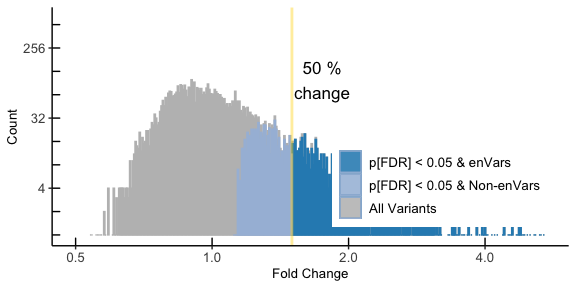
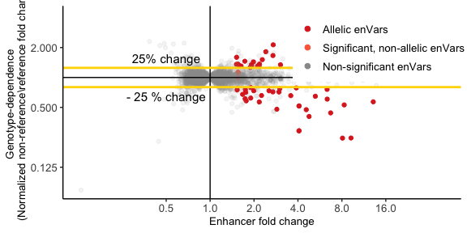

Massively Parallel Reporter Assay Analysis
================
Xiaoming Lu
2022-10-19

## Setup

Install these packages if you don’t already have them:

``` r
install.packages("tidyverse")
install.packages("readxl")

# You'll need Bioconductor to get DESeq2
install.packages("BiocManager")
BiocManager::install("DESeq2")

# Install mpraprofiler itself
devtools::install_github("WeirauchLab/mpraprofiler")
```

Then, load these libraries:

``` r
library(tidyverse)
library(readxl)
library(DESeq2)
library(mpraprofiler)
```

## Data Preparation for DESeq2

All the sample data are in the data folder, which is the SLE MPRA
dataset

``` r
# Read all the data Here we use data from the package. You can replace with
# your own data.
ext_data <- system.file("extdata", package = "mpraprofiler")
file_list <- list.files(ext_data, pattern = "*.xlsx")
file_loc <- paste(ext_data, file_list, sep = "/")
raw_counts <- read_xlsx(file_loc[2], sheet = "Raw MPRA count data ")

# Only include variants with >30 unique tags
filter_snps <- raw_counts %>%
    filter(Unique_Tag >= 30) %>%
    pull(Variant) %>%
    unique()
filter_counts <- raw_counts %>%
    filter(Variant %in% filter_snps)

# Build DESeq2 required matrix
cts <- filter_counts[, 6:ncol(filter_counts)]
row.names(cts) <- filter_counts$Oligo_ID
cts <- as.matrix(cts)

# This is wgat the required format for DESeq2 looks like
head(cts)
#>                      Plasmid_Control MPRA_Replicate_1 MPRA_Replicate_2
#> rs10015639_Non-Ref_G            5307            18618            21334
#> rs10015639_Ref_A                4616            15084            19510
#> rs10026154_Non-Ref_A            2471             8266            11033
#> rs10026154_Ref_G                2619             8814            12235
#> rs10032244_Non-Ref_G            7268            26675            30581
#> rs10032244_Ref_A               12719            44067            53640
#>                      MPRA_Replicate_3
#> rs10015639_Non-Ref_G            13640
#> rs10015639_Ref_A                12108
#> rs10026154_Non-Ref_A             6383
#> rs10026154_Ref_G                 7060
#> rs10032244_Non-Ref_G            20141
#> rs10032244_Ref_A                33421
```

## DESeq2 analysis

**You may refer to `DESeq2` package for more details**

Create the design matrix for DESeq2.

``` r
coldata <- data.frame(condition = c("ctrl", rep("sle", 3)), row.names = colnames(cts))

# check the design matrix has the same order as the count matrix.
all(rownames(coldata) == colnames(cts))
#> [1] TRUE
```

Perform DESeq2 analysis.

``` r
# library('DESeq2')
dds <- DESeqDataSetFromMatrix(countData = cts, colData = coldata, design = ~condition)
#> Warning in DESeqDataSet(se, design = design, ignoreRank): some variables in
#> design formula are characters, converting to factors

dds <- DESeq(dds)

# sle vs ctrl result
dds_result <- results(dds, contrast = c("condition", "sle", "ctrl"))

# plot
fold_enhancer_plot(dds_result, xmin = 0.5)
#> Warning: Removed 77 rows containing non-finite values (stat_bin).
#> Warning: Removed 70 rows containing non-finite values (stat_bin).
#> Warning: Transformation introduced infinite values in continuous y-axis
#> Transformation introduced infinite values in continuous y-axis
#> Transformation introduced infinite values in continuous y-axis
#> Warning: Removed 50 rows containing missing values (geom_bar).
#> Warning: Removed 193 rows containing missing values (geom_bar).
#> Warning: Removed 302 rows containing missing values (geom_bar).
```



## Define enhancers

### sle enhancer: More than 50% change with padj \< 0.05

``` r
dds_result_all <- as.data.frame(dds_result)

# only care about the SLE variant
anno <- read_xlsx(file_loc[1])
sle_variant <- anno %>%
    filter(SLE_Variant == 1) %>%
    pull(Variant) %>%
    unique()
dds_result_sle <- dds_result_all %>%
    rownames_to_column("Oligo_ID") %>%
    left_join(raw_counts[, 1:4], by = "Oligo_ID") %>%
    filter(Variant %in% sle_variant)

# 853 enhancer alleles
dds_sle_enhancer <- dds_result_sle %>%
    filter(log2FoldChange >= log2(1.5) & padj < 0.05)
dds_enAllele <- dds_sle_enhancer %>%
    pull(Oligo_ID) %>%
    unique()
length(dds_enAllele)
#> [1] 853

# 482 enhancer variant
dds_enVar <- dds_sle_enhancer %>%
    pull(Variant) %>%
    unique()
length(dds_enVar)
#> [1] 482
```

## Allelic Analysis

### Prepare the data: add 0.5 to avoid infinite problem

``` r
# just use the dataset prepared for DESeq2
cts <- cts + 0.5

# this step calculates the non-ref vs ref ratio for all the variants and sample
cts_nr_r_ratio <- nr_r_ratio(cts)
head(cts_nr_r_ratio)
#>   Plasmid_Control_nr/r_ratio MPRA_Replicate_1_nr/r_ratio
#> 1                  1.1496805                   1.2342802
#> 2                  0.9435007                   0.9378297
#> 3                  0.5714454                   0.6053327
#> 4                  0.8011571                   0.4502152
#> 5                  1.2491842                   1.6643535
#> 6                  1.0270453                   1.0082466
#>   MPRA_Replicate_2_nr/r_ratio MPRA_Replicate_3_nr/r_ratio        snp
#> 1                   1.0934881                   1.1265227 rs10015639
#> 2                   0.9017613                   0.9041144 rs10026154
#> 3                   0.5701196                   0.6026510 rs10032244
#> 4                   0.4588089                   0.4590293 rs10036748
#> 5                   1.4130758                   1.4801842 rs10048743
#> 6                   0.8621627                   1.0566792 rs10077437
#>            compare_nrvsr
#> 1 rs10015639_G_A_Non-Ref
#> 2 rs10026154_A_G_Non-Ref
#> 3 rs10032244_G_A_Non-Ref
#> 4 rs10036748_T_C_Non-Ref
#> 5 rs10048743_T_G_Non-Ref
#> 6 rs10077437_A_G_Non-Ref
```

### normalization over the control and do log2 transformation

``` r
# you need to indicate the exp data, ctrl data and the annotation data
allelic_all <- allelic_compare(cts_nr_r_ratio[, 2:4], cts_nr_r_ratio[, 1], cts_nr_r_ratio[,
    c("snp", "compare_nrvsr")])  # exp, ctrl, annotation
```

### get the max fold change for each variant

``` r
max_fold <- max_fold(dds_result_all)
```

### get the p-value for the significant enhancer

``` r
# the allelic log2 normalization data (allelic_compare) and the list of
# enhancer variant.
allelic_p <- allelic_compare_p(allelic_all, dds_enVar)
```

### get the significant allielic variant : Over than 25% change in either direction and padj \< 0.05

``` r
allelic_data <- allelic_p %>%
    filter(pFDR < 0.05 & (log2_aver >= log2(1.25) | log2_aver <= -log2(1.25)))

# allelic enVar

allelic_enVar <- allelic_data %>%
    pull(snp) %>%
    unique()
```

### Plot

``` r
# only sle
plot_data <- inner_join(allelic_all, max_fold, by = "snp") %>%
    left_join(allelic_p[, c("snp", "p_value", "pFDR")], by = "snp") %>%
    filter(snp %in% sle_variant) %>%
    mutate(pos = if_else(snp %in% allelic_enVar & (log2_aver >= log2(1.25) | log2_aver <=
        -log2(1.25)), 2, if_else(snp %in% allelic_enVar & (log2_aver < log2(1.25) &
        log2_aver > -log2(1.25)), 1, 0)))

# with indicator line
allelic_enhancer_dot_plot(plot_data, log2 = "log2_aver", max_fold = "max_fold", label = "pos")
#> Warning: It is deprecated to specify `guide = FALSE` to remove a guide. Please
#> use `guide = "none"` instead.
```


